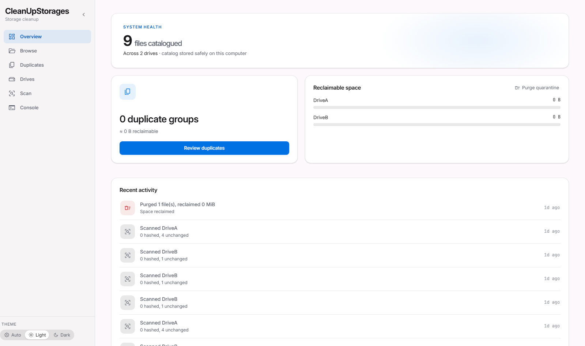
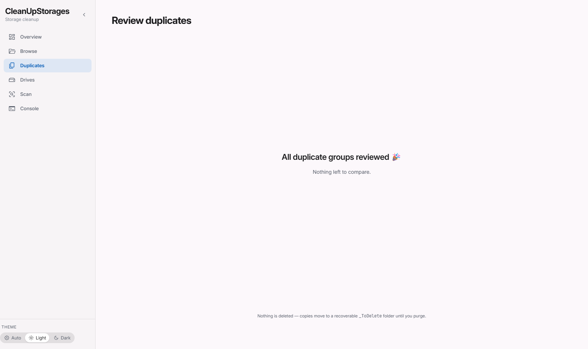
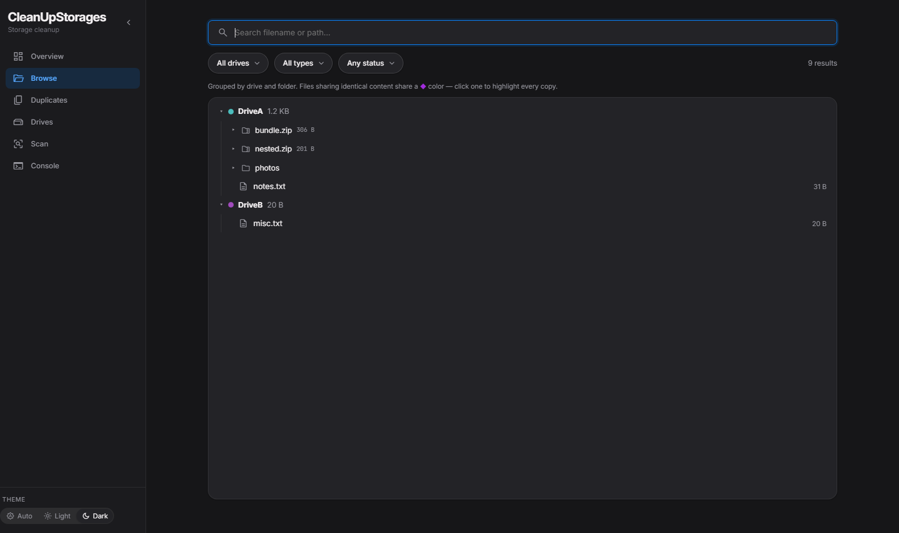

# CleanUpStorages

[](https://github.com/justPrototypeGit/CleanUpStorages/actions/workflows/ci.yml)
[](LICENSE)

Catalog, search and de-duplicate thousands of GB spread across near-full external drives —
**without ever losing a file.**



## What this is

Years of important, irreplaceable data — personal and academic — scattered across a pile of
external HDDs, most of them nearly full, most of them containing overlapping copies of each
other. You cannot plug them all in at once, and you cannot trust yourself to delete by hand.

CleanUpStorages crawls each drive, hashes every file with BLAKE3, and builds a **persistent
searchable catalog** that keeps working when the drive is unplugged. It then helps you review
duplicates one at a time and remove them — safely.

## Safety model

This is the whole point, so it comes before the feature list:

- **Nothing is ever deleted automatically.** Confirmed duplicates are *moved* to a `_ToDelete`
  folder on the same drive. That's a rename — near-instant, no copying, fully reversible.
- **`purge` is the only real delete**, and only you can trigger it.
- **The catalog lives on your computer, never on the drives**, so it survives a drive dying.
- **Archive repacks** build a verified temp copy and only swap after re-hashing every retained
  entry — the original is preserved in quarantine too.
- The web UI binds to `127.0.0.1` only, is CSRF-guarded, and ships **zero external requests** —
  no CDN, no fonts fetched at runtime, no telemetry. A test asserts this.

## Quick install

**From source** (needs [Rust](https://rustup.rs)):

```bash
git clone https://github.com/justPrototypeGit/CleanUpStorages.git
cd CleanUpStorages
cargo build --release
```

The binary lands at `target/release/cleanupstorages` (`.exe` on Windows). It's a single
self-contained executable — no runtime, no interpreter, no assets to copy.

## Usage

Catalog a drive, then open the UI:

```bash
cleanupstorages scan D:\        # crawl + hash + catalog
cleanupstorages browse          # opens the local web UI on 127.0.0.1
```

Other verbs:

| Command | What it does |
| --- | --- |
| `scan <path> [--force]` | Crawl a drive/folder, hash files, update the catalog |
| `search <query>` | Search the catalog (works for unplugged drives) |
| `status` | Catalog summary |
| `duplicates` | List duplicate groups |
| `quarantine <id>…` | Move duplicates to `_ToDelete` |
| `purge [--all]` | **The only real delete** — empty `_ToDelete` |
| `repack <id>` | Remove a duplicate from inside an archive, safely |
| `forget <volumeId>` | Drop a drive from the catalog (files untouched) |
| `browse` | Local web UI |

Add `-v` for verbose logs; `RUST_LOG` overrides.



The UI has six pages — Overview, Browse (tree view with duplicate highlighting), Duplicates,
Drives, Scan and Console — in light and dark themes.



## How this was built

Every feature in this repo started as a **design spec**, became an **implementation plan**, and
only then got written — with an AI doing the work and a human reviewing at each gate. Those
specs and plans are committed next to the code.

**→ [docs/ai-sdlc.md](docs/ai-sdlc.md)** — how the loop works, what it's good at, and where it
needed a human.

## Docs

- [docs/ai-sdlc.md](docs/ai-sdlc.md) — the AI-driven development loop
- [docs/superpowers/specs/](docs/superpowers/specs/) — design specs
- [docs/superpowers/plans/](docs/superpowers/plans/) — implementation plans
- [docs/TESTING-GUIDE.md](docs/TESTING-GUIDE.md) — safe end-to-end walkthrough
- [docs/future-ideas.md](docs/future-ideas.md) — deferred ideas
- [CONTRIBUTING.md](CONTRIBUTING.md) — how to build, test and contribute

## Status

Phases 1 (catalog + search) and 2 (deduplicate) are implemented; the web UI is complete.
Phase 3 (reorganize into a clean taxonomy) is deliberately deferred.

## Contributing

Contributions are welcome — see [CONTRIBUTING.md](CONTRIBUTING.md). Please open an issue before
large changes. By participating you agree to the [Code of Conduct](CODE_OF_CONDUCT.md).

## Licence

[AGPL-3.0-only](LICENSE) © the CleanUpStorages authors.

The vendored fonts in `assets/` are **not** AGPL — they ship unmodified under their own
licences (Inter and JetBrains Mono under SIL OFL-1.1, Material Symbols under Apache-2.0).
See [assets/LICENSES.md](assets/LICENSES.md).
