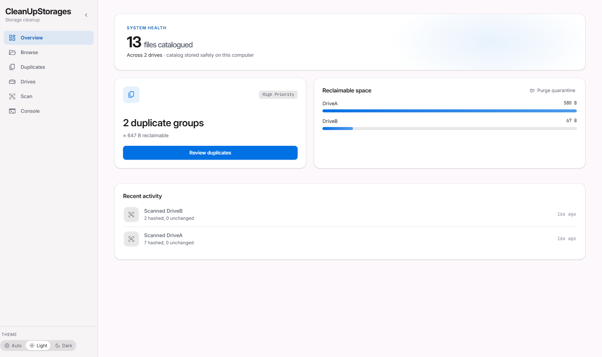
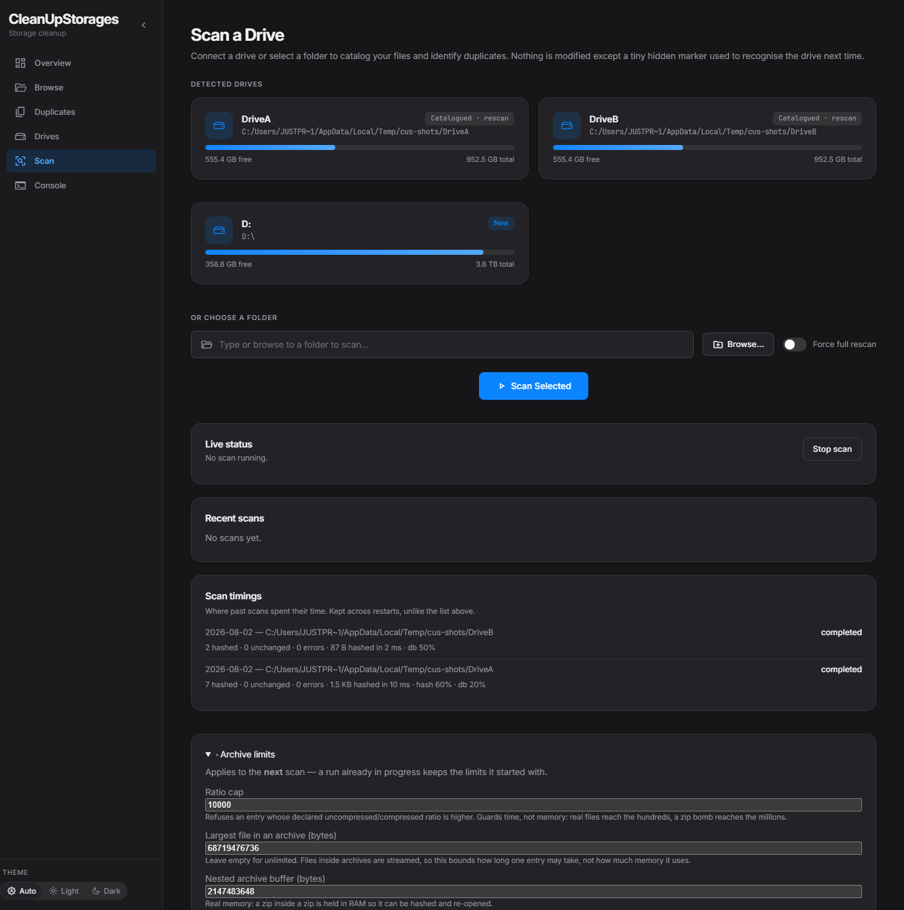
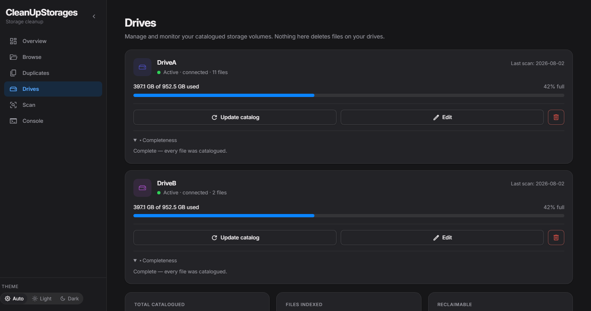
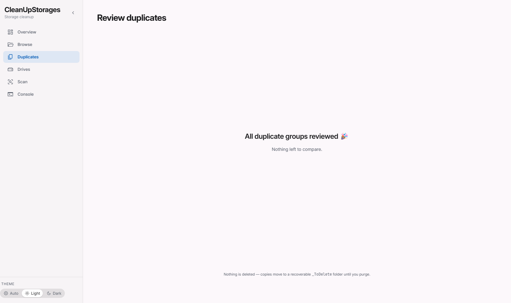
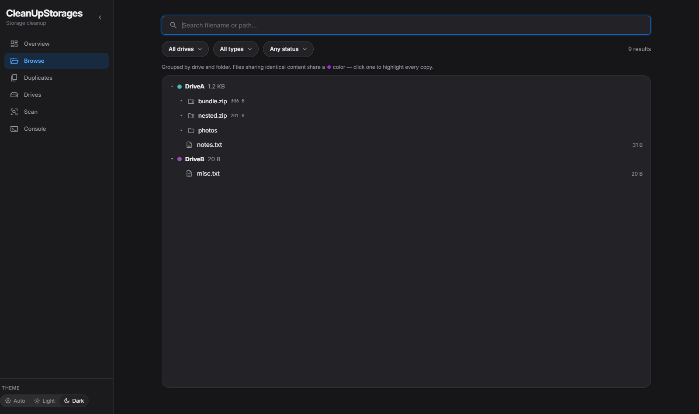
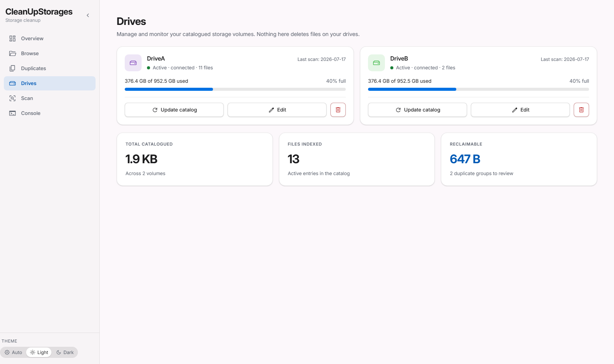

# CleanUpStorages

[](https://github.com/justPrototypeGit/CleanUpStorages/actions/workflows/ci.yml)
[](LICENSE)

Catalog, search and de-duplicate thousands of GB spread across near-full external drives —
**without ever losing a file.**



## What this is

Years of important, irreplaceable data — personal and academic — scattered across a pile of
external HDDs, most of them nearly full, most of them containing overlapping copies of each
other. You cannot plug them all in at once, and you cannot trust yourself to delete by hand.

CleanUpStorages crawls each drive, hashes every file with BLAKE3, and builds a **persistent
searchable catalog** that keeps working when the drive is unplugged. It then helps you review
duplicates one at a time and remove them — safely.

## Safety model

This is the whole point, so it comes before the feature list:

- **Nothing is ever deleted automatically.** Confirmed duplicates are *moved* to a `_ToDelete`
  folder on the same drive. That's a rename — near-instant, no copying, fully reversible.
- **`purge` is the only real delete**, and only you can trigger it.
- **The catalog lives on your computer, never on the drives**, so it survives a drive dying.
- **Archive repacks** build a verified temp copy and only swap after re-hashing every retained
  entry — the original is preserved in quarantine too.
- The web UI binds to `127.0.0.1` only, is CSRF-guarded, and ships **zero external requests** —
  no CDN, no fonts fetched at runtime, no telemetry. A test asserts this.

## Quick install

**Download a binary** (no Rust needed) — grab the archive for your OS from the
[Releases page](https://github.com/justPrototypeGit/CleanUpStorages/releases):

- **Windows:** `cleanupstorages-<version>-x86_64-pc-windows-msvc.zip`
- **macOS (Apple Silicon):** `cleanupstorages-<version>-aarch64-apple-darwin.tar.gz`

Unzip it and run `cleanupstorages`. The binaries are unsigned, so your OS warns on first run — the
release notes explain how to get past Gatekeeper / SmartScreen, and every release ships a
`SHA256SUMS` file you can verify against (`sha256sum -c SHA256SUMS` on macOS, `Get-FileHash` in
PowerShell).

**From source** (needs [Rust](https://rustup.rs)):

```bash
git clone https://github.com/justPrototypeGit/CleanUpStorages.git
cd CleanUpStorages
cargo build --release
```

The binary lands at `target/release/cleanupstorages` (`.exe` on Windows). It's a single
self-contained executable — no runtime, no interpreter, no assets to copy.

## Usage

Catalog a drive, then open the UI:

```bash
cleanupstorages scan D:\        # crawl + hash + catalog
cleanupstorages browse          # opens the local web UI on 127.0.0.1
```

Other verbs:

| Command | What it does |
| --- | --- |
| `scan <path> [--force] [--no-count]` | Crawl a drive/folder, hash files, update the catalog |
| `search <query> [--category] [--volume] [--status]` | Search the catalog (works for unplugged drives) |
| `status` | Catalog summary |
| `duplicates` | List duplicate groups, with ids to act on |
| `quarantine <mount> <id>…` | Move duplicates (ids from `duplicates`) to `_ToDelete` on that drive |
| `purge [mount] [--all]` | **The only real delete** — empty `_ToDelete` on one drive, or every connected drive with `--all` |
| `repack <mount> <entry_id>` | Remove a duplicate from inside an archive, safely |
| `forget <mount>` | Drop a drive from the catalog by its mount path (files untouched) |
| `rename <mount> [--name] [--description]` | Set a drive's custom name/description (shown in the UI) |
| `browse [--no-open]` | Local web UI |

Add `-v` for verbose logs; `RUST_LOG` overrides.

### Stopping and resuming a scan

Cataloguing a full drive takes hours, so a scan can be stopped at any time — **Ctrl+C**, or the
**Stop** button on the web UI's Scan page. It finishes the file it is on, commits what it has, and
**never marks anything missing**. Re-run the same command to continue: already-catalogued files are
skipped without re-reading them.

There is no separate "resume" command and nothing to clean up. The skip is what makes this work — a
re-run stats each file and checks one index, rather than re-hashing it:

| same folder, 225,285 files / 124.2 GB | wall |
| --- | --- |
| first scan (hashes every byte) | **1.01 h** |
| re-run over the same catalogued files | **25 s** |

Roughly 145x cheaper than the scan it replaces — which is why there is no checkpoint file to go stale.

Before hashing starts, the scan counts the tree so it can show a percentage and an ETA:

```
Counting… 148,746 files (121 GB)
Scanning  38% · 56,412/148,746 files · 46.1/121 GB · 34.8 MB/s · ETA 1h 42m
```

Pass `--no-count` to skip that pass and start hashing immediately. You still get live counters and a
rate; the percentage and ETA are simply absent rather than guessed.

After a scan the CLI reports whether the catalogue is complete:

```
Completeness: 12 files NOT catalogued, 35 unverified, 2 unreadable directories (contents unknown).
```

**Not catalogued** means the file is absent from the catalogue entirely — invisible to search and
deduplication. **Unverified** means it is catalogued but this scan could not re-read it, so its hash
may be stale. **Unreadable directories** are counted separately because the number of files inside
one is unknown. The Drives page lists the paths and reasons. Fixing the cause and re-scanning clears
them automatically.

### Archive limits

Scanning descends into zip archives and catalogues what is inside. Five limits govern that, and
`scan` prints them as it starts:

```
Archive limits: ratio cap 10000, largest entry 64.0 GB, nested buffer 2.0 GB (total 2.0 GB), depth 8
```

- **Ratio cap** refuses an entry whose declared uncompressed/compressed ratio is higher. It bounds
  *time*, not memory — genuine files reach the hundreds (an FPGA bitstream measured 815), while a zip
  bomb reaches the millions.
- **Largest entry** is the biggest file inside an archive that will be catalogued, or unlimited.
  These are streamed, so this bounds how long one entry may take rather than memory use.
- **Nested buffer** and **total buffer** are real memory: a zip inside a zip must be held in RAM to
  be hashed and re-opened.
- **Depth** bounds how many archives deep the scan will go.

Edit them on the **Scan** page of `cleanupstorages browse`, or in `settings.json` beside the
catalogue. Changes apply to the next scan. If that file is missing or invalid the defaults are used
and a warning is logged — a bad settings file never stops a scan.



Archives are recognised by **their content, not their extension**. A zip renamed to something else is
catalogued properly, and a file that merely ends in `.zip` — such as a macOS `._name.zip` sidecar — is
not mistaken for one. Note the consequence: any file in zip format is an archive, including `.docx`,
`.xlsx`, `.jar` and `.epub`.

### Is the catalogue complete?

A scan continues past files it cannot read, so `scan` and the **Drives** page report what was missed:



**Not catalogued** means the file is absent from the catalogue entirely — invisible to search and
deduplication. **Unverified** means it is catalogued but this scan could not re-read it, so its hash
may be stale. **Unreadable directories** are counted separately, because the number of files inside
one is unknown. Fixing the cause and re-scanning clears them automatically.

### Make scans ~30% faster on Windows (worth doing before a big scan)

Cataloguing hashes every byte on the drive, so Windows Defender inspects every file the scan opens.
Measured on a real 4 TB external drive — the same 148,746 files, scanned twice with `--force`:

| | wall | throughput |
| --- | --- | --- |
| Defender active | 73.1 min | 27.7 MB/s |
| drive excluded | **51.4 min** | **39.4 MB/s** |

**~30% faster, and the effect concentrates on the many-small-file phases** (hashing throughput nearly
doubled), because Defender's cost is per *file opened*, not per byte. On a 20 TB target that is
roughly two days saved.

To exclude a drive: **Windows Security → Virus & threat protection → Manage settings →
Exclusions → Add an exclusion → Folder**, then pick the drive or folder you scan.

This is your own archival data on your own machine, and the tool only ever reads it — but it is your
call, and you can remove the exclusion after the scan. Nothing else in this project needs it.

> Scans are single-threaded on purpose. Parallel reading was built, measured, and abandoned: on a
> spinning drive it was 1.8–2.0× *slower*, because one read head serving several streams seeks
> instead of reading. See [docs/benchmarking-scans.md](docs/benchmarking-scans.md).



The UI has six pages — Overview, Browse (tree view with duplicate highlighting), Duplicates,
Drives, Scan and Console — in light and dark themes.



Drives you've catalogued stay listed whether or not they're plugged in, with their capacity, scan
state and anything still sitting in quarantine:



## How this was built

Every feature in this repo started as a **design spec**, became an **implementation plan**, and
only then got written — with an AI doing the work and a human reviewing at each gate. Those
specs and plans are committed next to the code.

**→ [docs/ai-sdlc.md](docs/ai-sdlc.md)** — how the loop works, what it's good at, and where it
needed a human.

## Docs

- [docs/ai-sdlc.md](docs/ai-sdlc.md) — the AI-driven development loop
- [docs/superpowers/specs/](docs/superpowers/specs/) — design specs
- [docs/superpowers/plans/](docs/superpowers/plans/) — implementation plans
- [docs/TESTING-GUIDE.md](docs/TESTING-GUIDE.md) — safe end-to-end walkthrough
- [docs/future-ideas.md](docs/future-ideas.md) — deferred ideas
- [CONTRIBUTING.md](CONTRIBUTING.md) — how to build, test and contribute

## Status

Phases 1 (catalog + search) and 2 (deduplicate) are implemented; the web UI is complete.
Phase 3 (reorganize into a clean taxonomy) is deliberately deferred.

## Contributing

Contributions are welcome — see [CONTRIBUTING.md](CONTRIBUTING.md). Please open an issue before
large changes. By participating you agree to the [Code of Conduct](CODE_OF_CONDUCT.md).

## Licence

[AGPL-3.0-only](LICENSE) © the CleanUpStorages authors.

The vendored fonts in `assets/` are **not** AGPL — they ship unmodified under their own
licences (Inter and JetBrains Mono under SIL OFL-1.1, Material Symbols under Apache-2.0).
See [assets/LICENSES.md](assets/LICENSES.md).
